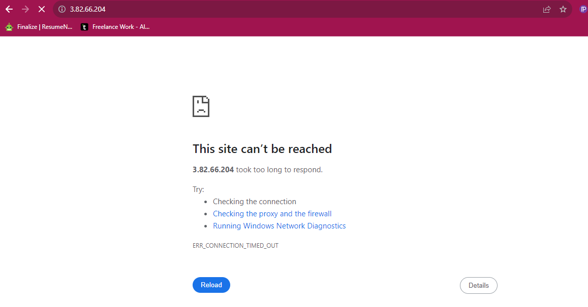

# Implementing-load-balancers-with-Nginx

In computer terms, load balancing means distributing the work or tasks among several computers or servers so that no computer gets overload with too much work. This helps to keep everything running somoothly and ensures that websites and apps work quickly and don't get too slow. It's like a teamwork for computers. The load balancer stands in front of the webservers to distribute the traffic evenly to the webservers.

Nginx is a versatile software, It can act like a webserver,reverse proxy, and a load balancer etc.

## ERRORS I ENCOUNTERED ON THIS PROJECT

1. I added 8000 when running the ip address on the brower which resulted in delay in loading and error message. 

2. Ater i removed the 8000 the error persisted before i opened port 80 in security group on Aws console

