## Implementing Loadbalancers with Nginx

### Setting up a basic load balancer

### Step 1

I provisioned 2 EC2 instances on AWS console to serve as a web server 1 and 2

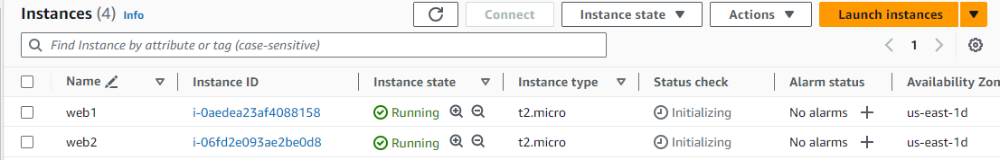

### Step 2

I opened port 8000 of the webserves where they will be running and to allow traffic from anywhere

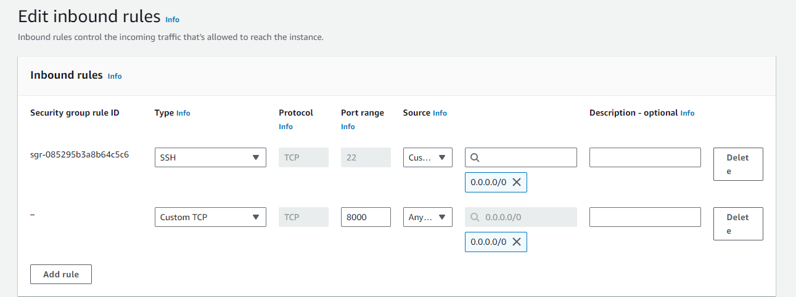

### Step 3

I installed apache on the two webservers by run `sudo apt update -y &&  sudo apt install apache2 -y`
on each server.

webserver1

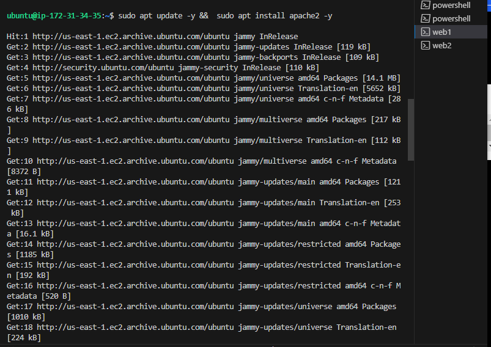

webserver2

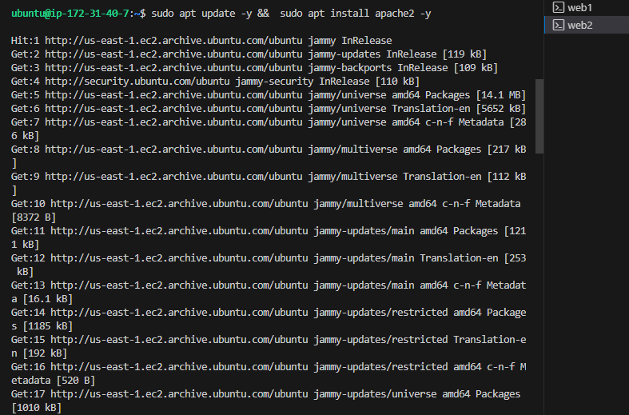

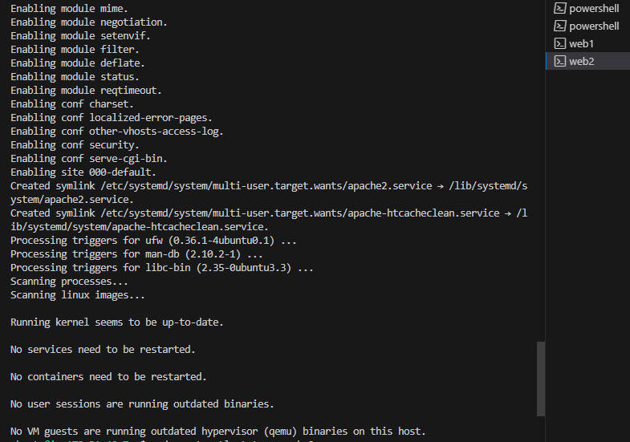

After the installation, I run ` sudo systemctl status apache2` to verify that apache is running on both servers.

webserver1

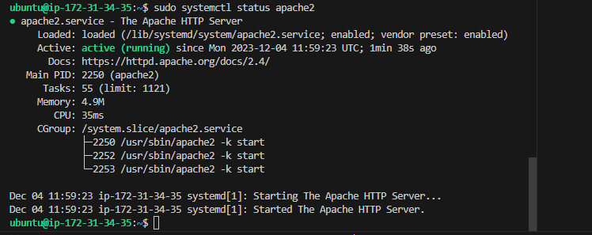

webserver2

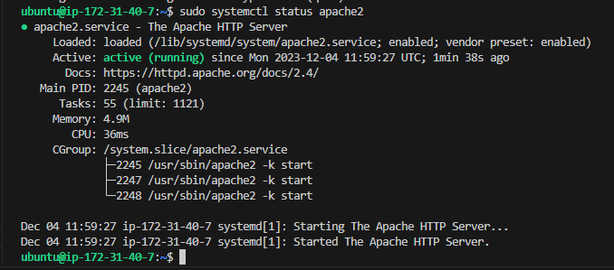

### Step 4

In the step I configured apache webservers to to serve content on port 8000 instead of its default which is port 80. Also, created a new index.html file and then override apache webserver's default html file with the new file.

A. Configuring Apache on the both webservers to serve content on port 8000

i. I opened this file `sudo vi /etc/apache2/ports.conf` to add a new listen directive for port 8000 and then saved the file.

webserver1

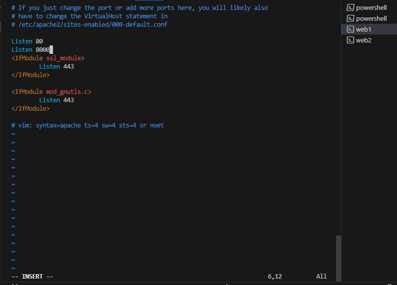

webserver2

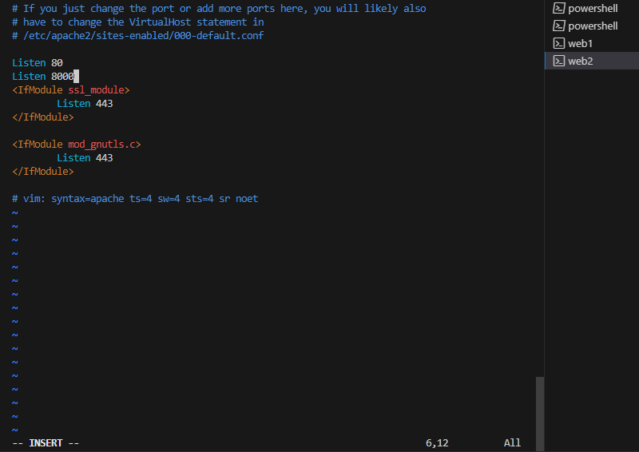

ii. I opened the second config file too to edit virtual host from 8o to 8000 by running `sudo vi /etc/apache2/sites-available/000-default.conf`

webserver1

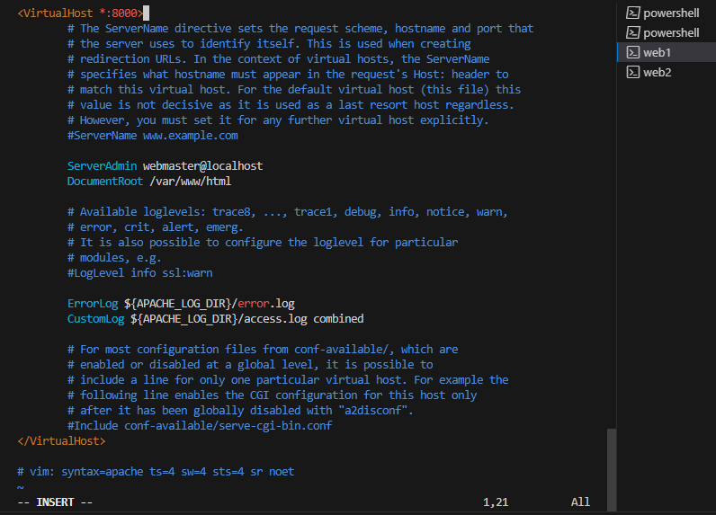

webserver2

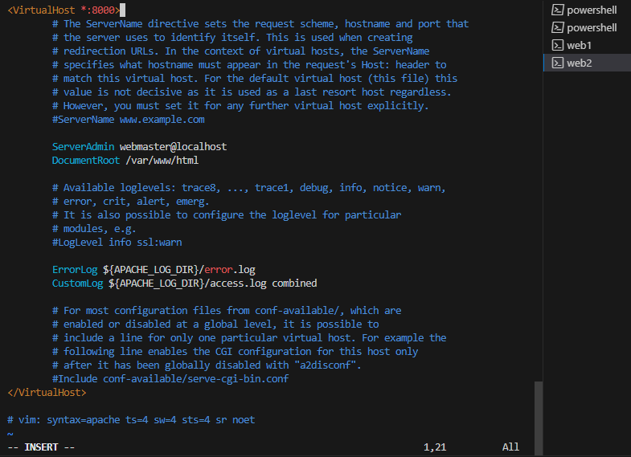

iii. I restarted the apache to load the new configuration using `sudo systemctl restart apache2`

webserver1

webserver2

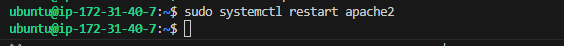

B. Creating the new html file

i. I created a new file using `sudo vi index.html` on both servers and pasted the code into the file and input my ip address in the space of public ip and saved the file.

        <!DOCTYPE html>
        <html>
        <head>
            <title>My EC2 Instance</title>
        </head>
        <body>
            <h1>Welcome to my EC2 instance</h1>
            
Public IP: YOUR_PUBLIC_IP

        </body>
        </html>

 

 webserver1

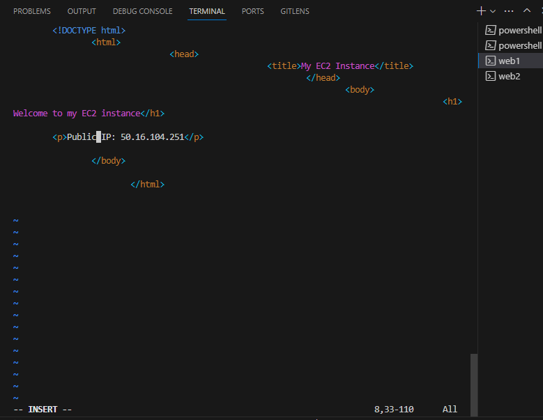

webserver2

  

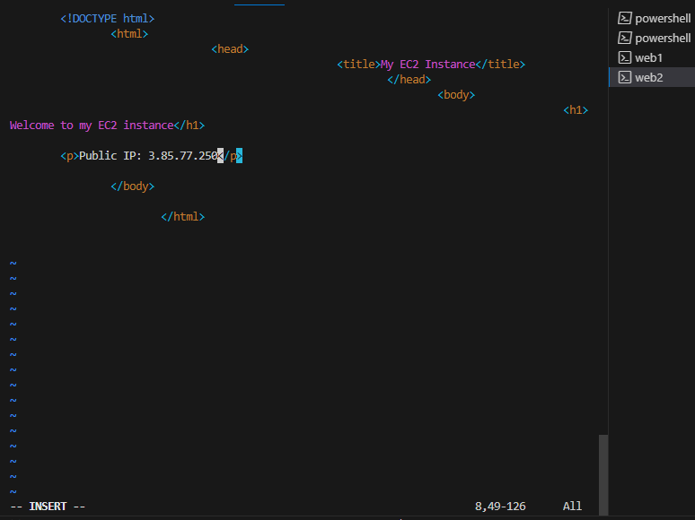

ii. I changed the ownership of the file on both servers by running `sudo chown www-data:www-data ./index.html` 

webserver1

webserver2

C. To override the default html file of Apahe webserver, i run ` sudo cp -f ./index.html /var/www/html/index.html` on both servers and then restarted Apache to load the new configuration using `sudo systemctl restart apache2`

webserver1

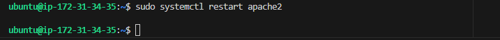

webserver2

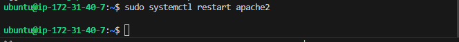

Then, I texted the ip address on the broswer

webserver1

webserver2

### Step 5

i. I provisioned a new EC2 instance to serve as a loadbalancer. 

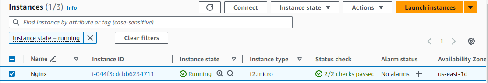

ii. Logged into the server on the terminal using ssh

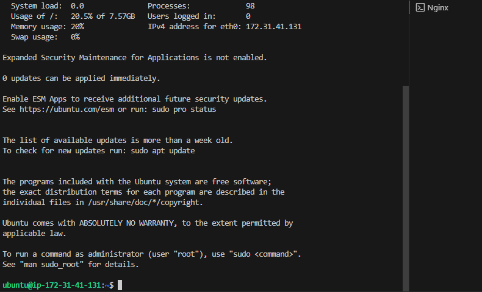

iii. Updated the softwares and installed Nginx using ` sudo apt update -y && sudo apt install nginx -y` 

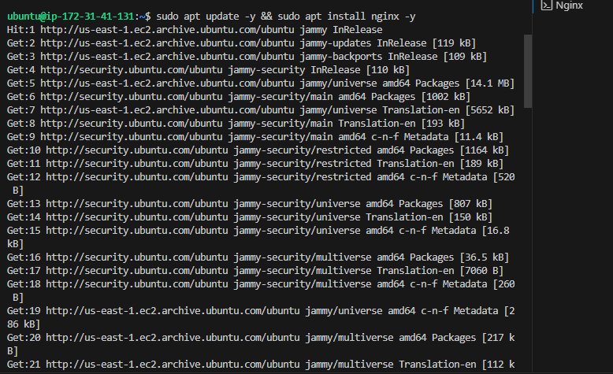

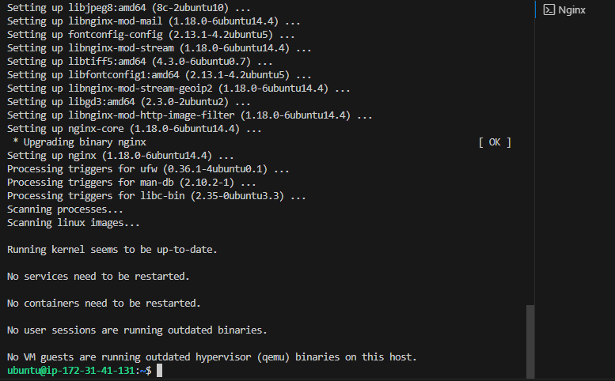

iv. Verified that Nginx is installed using `sudo systemctl status nginx`

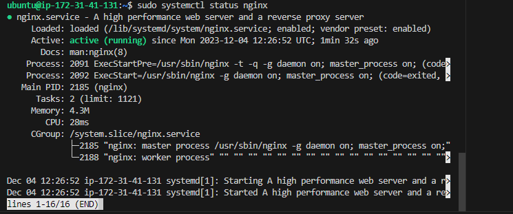

v. Opened Nginx configuration file to configure Nginx to act as a loadbalancer `sudo vi /etc/nginx/conf.d/loadbalancer.conf`

Paste the code inside the file 
        
        upstream backend_servers {

            # your are to replace the public IP and Port to that of your webservers
            server 127.0.0.1:8000; # public IP and port for webserser 1
            server 127.0.0.1:8000; # public IP and port for webserver 2

        }

        server {
            listen 80;
            server_name <your load balancer's public IP addres>; # provide your load balancers public IP address

            location / {
                proxy_pass http://backend_servers;
                proxy_set_header Host $host;
                proxy_set_header X-Real-IP $remote_addr;
                proxy_set_header X-Forwarded-For $proxy_add_x_forwarded_for;
            }
        }
    
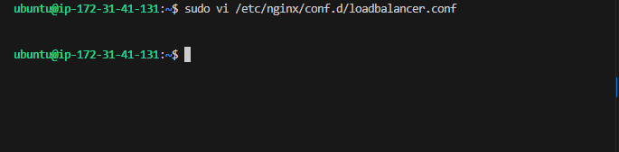

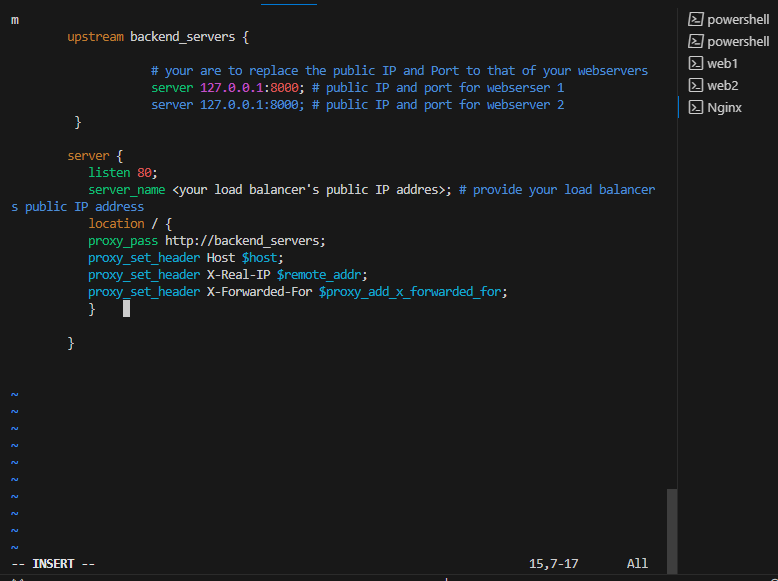

vi. Test that the configuration is ok `sudo nginx -t`

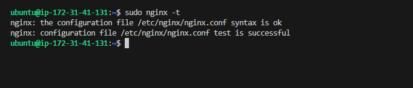

vii. Restart the Nginx to load the new configuration ` sudo systemctl restart nginx`

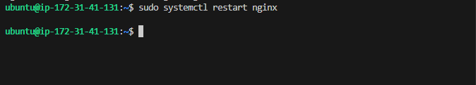

viii. I pasted the public Ip address of the load balancer on the browser

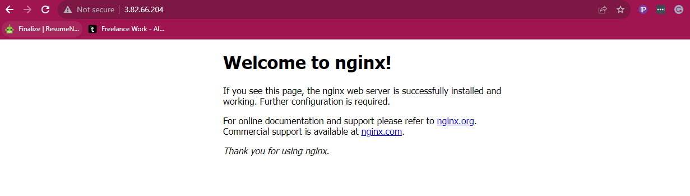

THANK YOU FOR REVIEWING!

